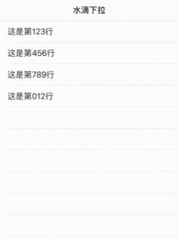

# ZCSlimeRefresh



## 以下简单集成步骤：

```ruby
pod 'ZCSlimeRefresh'
```
```<ZCRefreshDelegate>```

```#import "ZCRefreshView.h"```

```@property (nonatomic, strong) ZCRefreshView *zcRefreshView;```
```
//懒加载水滴下拉框架
- (ZCRefreshView *)zcRefreshView {
    
    if (!_zcRefreshView) {
        _zcRefreshView = [[ZCRefreshView alloc] init];
        _zcRefreshView.delegate = self;
        _zcRefreshView.upInset = 0;
        _zcRefreshView.slimeMissWhenGoingBack = YES;
        _zcRefreshView.slime.skinColor = [UIColor whiteColor];
        _zcRefreshView.slime.lineWith = 1;
        _zcRefreshView.slime.shadowBlur = 4;
        _zcRefreshView.slime.shadowColor = [UIColor grayColor];
        _zcRefreshView.slime.bodyColor = [UIColor blackColor];
    }
    return _zcRefreshView;
}
```
把水滴框架添加到tableview上

```
[self.tableView addSubview:self.zcRefreshView];
```


```
//实现水滴代理
/**
 下拉回调

 @param refreshView 水滴block
 */
- (void)slimeRefreshStartRefresh:(ZCRefreshView *)refreshView {
    
    //刷新当前页面
    [self testViewArray:self.array];
}

- (void)scrollViewDidScroll:(UIScrollView *)scrollView {
    [self.zcRefreshView scrollViewDidScroll];
}

- (void)scrollViewDidEndDragging:(UIScrollView *)scrollView willDecelerate:(BOOL)decelerate {
    [self.zcRefreshView scrollViewDidEndDraging];
}

```
